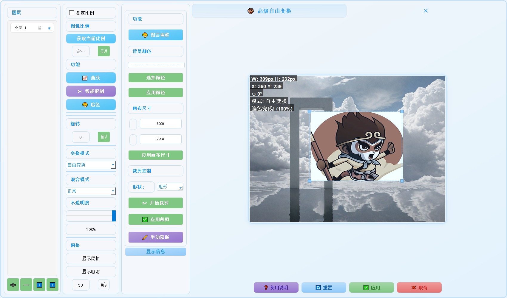

# 🐵 ComfyUI 高级图像预处理插件

一个功能强大的 ComfyUI 图像处理插件,提供专业级的图层编辑和变换功能。

## ✨ 主要功能节点

### 🎨 图像预处理节点
- 多图层管理与编辑
- 自由变换与透视变换
- 智能抠图与背景移除
- 蒙版编辑工具
- 混合模式与不透明度调节

### 📸 图像调节节点
- 实时预览图像复合
- RGB图像分离
- 图像翻转旋转
- 尺寸固定与获取
- 色彩迁移

### 💾 保存输出节点
- 专用保存
- 专用保存PLUS
- 批量保存
- 文本保存

### 🔄 批处理节点
- 任意图像加载
- 批量图像加载
- 批量图像名称获取

### 🎚️ 控制节点
- 专用权重滑条
- 专用遮罩滑条
- 模糊滑条

### 🖼️ 图像处理节点
- 遮罩任意合并
- 透明图像裁剪
- RGBA转RGB
- 添加水印

## 🛠️ 使用说明

### 图像预处理节点
1. 添加图层: 支持拖拽或从文件添加
2. 图层编辑: 
   - 移动/缩放/旋转
   - 透视变换
   - 混合模式调节
   - 不透明度控制

### 智能抠图
1. 选择目标图层
2. 输入提示词(支持中英文)
3. 选择抠图模型
4. 调整细节参数

### 背景移除
1. 选择图层
2. 设置阈值
3. 选择处理模型
4. 应用效果

## ⌨️ 快捷键

- Ctrl+Z: 撤销
- Ctrl+Y: 重做
- Ctrl+C: 复制图层
- Ctrl+V: 粘贴图层
- Delete: 删除图层
- Space: 重置变换

## 🔍 常见问题

1. 图层无法编辑
   - 检查图层是否锁定
   - 确认操作模式是否正确
   - 验证图层是否可见

2. 抠图效果不理想
   - 优化提示词
   - 调整模型参数
   - 使用细节优化

3. 性能问题
   - 减少同时打开的图层数量
   - 降低预览分辨率
   - 关闭不需要的图层显示

## 📸 功能展示

### 智能抠图

*支持中英文提示词的智能抠图功能*

### 追色功能

*自动匹配背景图片的颜色风格*

### 曲线调整

*专业的曲线编辑功能*

### 图层效果

*丰富的图层特效*

### 水印添加

*丰富的水印添加功能* 

### 背景移除

*丰富的背景移除功能*

### 窗口大小调节

*窗口大小调节功能*

### 主题设置

*主题设置功能*

## 📊 效果对比

### 智能抠图对比
| 原图 | 抠图结果 |
|------|----------|
|||

### 追色效果对比
| 原图 | 追色后 |
|------|---------|
|||

## 🛠️ 安装方法

1. 下载插件文件
2. 将文件夹放入 ComfyUI 的 `custom_nodes` 目录
3. 重启 ComfyUI
4. 首次使用需要授权验证

## 🎯 使用方法

### 基础操作

1. 在节点列表中找到 "🐵 图像预处理" 
2. 连接输入:
   - `background`: 背景图像(必选)
   - `foreground`: 前景图像(可选)
   - `mask`: 蒙版(可选)
   - `invert_mask`: 是否反转蒙版
3. 运行后会打开编辑窗口

### 图层操作

- **添加图层**: 点击 "+" 按钮或拖放图片
- **删除图层**: 选中图层后点击 "-" 按钮或按 Del 键
- **图层排序**: 拖动图层列表或使用上下箭头按钮
- **图层属性**: 双击图层名称可重命名

### 蒙版编辑

- **画笔工具**: 自由绘制蒙版
- **快速选择**: 智能选择相似区域
- **魔法棒**: 选择相似颜色区域
- **钢笔工具**: 精确路径绘制
- **反转蒙版**: 快捷键 I 或点击反转按钮

## ⌨️ 快捷键

| 快捷键 | 功能 |
|--------|------|
| 1-9 | 快速切换图层 |
| Ctrl+C | 复制图层 |
| Ctrl+V | 粘贴图层 |
| Ctrl+L | 锁定/解锁图层 |
| Space | 显示/隐藏图层 |
| Del | 删除图层 |
| X | 切换画笔模式(显示/隐藏) |
| I | 反转蒙版 |

## 🎨 混合模式

- 正常
- 变暗/变亮
- 正片叠底/滤色
- 颜色加深/减淡
- 线性加深/减淡
- 叠加
- 柔光/强光
- 差值/排除

## ⚠️ 注意事项

1. 使用前请确保已安装所需依赖
2. 部分功能需要联网使用
3. 请勿商用，需要请联系作者
4. 建议定期保存编辑结果
5. 注意预览窗口的提示信息

## 🔍 常见问题

1. Q: 变换不生效?
   - A: 检查图层是否被锁定
   - A: 确认是否在正确的变换模式下

2. Q: 智能抠图失败?
   - A: 检查网络连接
   - A: 尝试调整提示词
   - A: 更换其他抠图模型

3. Q: 追色效果不理想?
   - A: 调整匹配强度
   - A: 开启/关闭肤色保护
   - A: 调整自动参数范围

4. Q: 蒙版编辑不生效?
   - A: 检查画笔模式(显示/隐藏)
   - A: 确认图层未锁定
   - A: 检查工具设置参数

5. 漏光功能不生效请下载下面的模型放置同级目录下
  - 通过网盘分享的文件：light_leak.pkl
  链接: https://pan.baidu.com/s/13BGDib-_SbFziHQohqwvZg?pwd=jyt8 提取码: jyt8 
  --来自百度网盘超级会员v6的分享

## 📞 联系方式

- 微信: xiutuxiaoliu
- 抖音: 悟空(AI摄影)、大师兄(AIGC)

## 📝 更新日志

### v5.0.0 (2025.2.13)
- 新增钢笔工具
- 优化蒙版编辑功能
- 增加多种混合模式
- 完善快捷键支持
- 修复已知问题
- 新增水印添加功能
- 新增曲线调整功能
- 新增图层效果功能
- 新增背景移除功能
- 新增蒙版编辑功能
- 新增快捷键支持
- 新增窗口大小调节，让不同的电脑显示不同的窗口大小
- 新增主题设置，让不同的电脑显示不同的主题
- 修复前景图像尺寸拉伸问题
- 修改前景图输入为可选输入
- 新增多种rgb调节
- 修复已知问题
## 📄 许可证

- v1版本的供大家无偿免费使用
- 如需使用请联系作者获取授权

## 🌟 致谢

感谢所有为这个项目提供反馈和建议的用户。

---

**作者:** 悟空  
**版本:** v5.0.0  
**更新时间:** 2025.2.15
